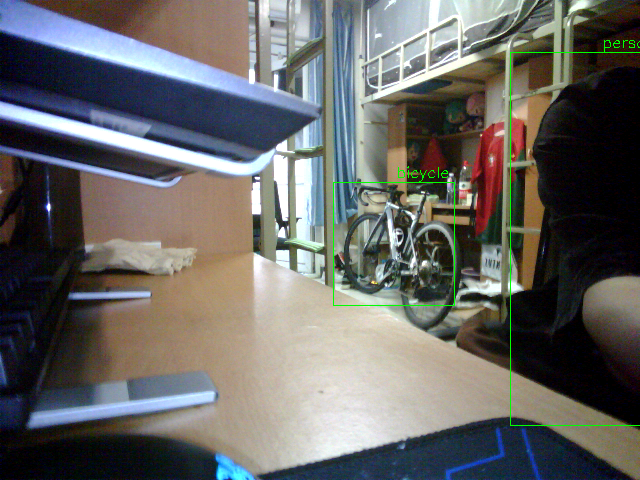

## 智能农场监控系统

[==== 控制平台 智能农场监控系统 ====](http://192.144.200.235:8080/home)

1、能够监控农场内的温湿度，并实时上报到后台。

2、能够监控养殖动物的活动范围，当动物跑出指定范围时上传证据图片，提醒工作人员。

---

### 技术解析

#### 1、目标检测

开发平台为ARMv7架构的NXP.IMX6ULL

目标识别功能，移植了前向推理框架[ncnn](https://github.com/Tencent/ncnn)

和轻量级目标检测算法FastestDet

> **FastestDet是针对计算资源紧缺的ARM平台设计的，突出单核效能**，因为在实际业务场景中，不会把所有CPU资源都给推理框架做模型推理的，假如说你想在例如树莓派, RK3399, RK3568去跑实时目标检测，那么FastestDet是比较好的选择，或者移动端上不想占用太多cpu资源，也可以去用单核并设置cpu sleep去推理FastestDet，在低功耗的条件下运行算法。

然而由于IMX6ULL资源有限，即使使用该算法，依然无法流畅地运行实时推理（存在一定延迟）。

#### 2、温湿度检测

采用I2C协议的SHT20传感器

#### 3、与服务器通信

在开发板上移植了thttpd服务器和frp进行内网穿透。

---

#### 文件说明

+ FastestDet_NCNN-master为算法实现部分 [FastestDet](https://github.com/dog-qiuqiu/FastestDet)
+ readtek是参考移植的wifi驱动代码

- asyncnoti.c、sht20_i2c_driver.c为自己实现的驱动代码
- v4l2_camera.c 实现了ov2640摄像头流畅捕捉画面，当按下按键时进行ncnn推理完成目标识别。
- video_v4l2_camera.c 实现了实时目标检测功能（存在一定延时）

